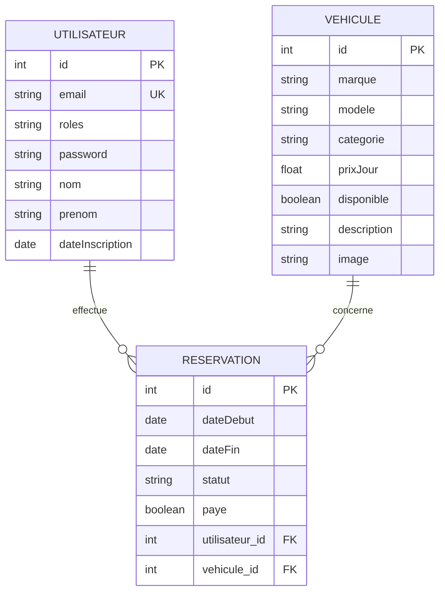

# Jalon 3 — Modélisation de la Base de Données
## NextRide — Plateforme de location de véhicules

> **Formation :** Concepteur Développeur d'Applications (CDA) — IPSSI Lille
> **Auteur :** Azeddine AMARI
> **Date :** 2026
> **Version :** 1.0
>
> Ce document a été rédigé *a posteriori* à partir du schéma réellement implémenté (entités
> Doctrine + migrations SQL exécutées), afin de garantir une cohérence totale entre la
> modélisation et le code livré.

---

## Sommaire

1. [Introduction à la méthode (MERISE)](#1-introduction-à-la-méthode-merise)
2. [Dictionnaire des données](#2-dictionnaire-des-données)
3. [Modèle Conceptuel de Données (MCD)](#3-modèle-conceptuel-de-données-mcd)
4. [Modèle Logique de Données (MLD)](#4-modèle-logique-de-données-mld)
5. [Modèle Physique de Données (MPD)](#5-modèle-physique-de-données-mpd)
6. [Justifications et vérification](#6-justifications-et-vérification)

---

## 1. Introduction à la méthode (MERISE)

Conformément à MERISE, la modélisation de la base de données de NextRide suit trois étapes :
le **Modèle Conceptuel de Données (MCD)**, qui identifie les entités métier et leurs
associations indépendamment de toute technologie ; le **Modèle Logique de Données (MLD)**, qui
traduit le MCD en tables relationnelles ; et le **Modèle Physique de Données (MPD)**, qui
spécifie le schéma concret pour le SGBD choisi (MySQL 8.0, via Doctrine ORM). Cette progression
garantit que la base répond aux besoins fonctionnels du CDCF (Jalon 1) tout en étant optimisée
pour le moteur de stockage utilisé.

## 2. Dictionnaire des données

### Entité UTILISATEUR

| Attribut | Type | Contrainte | Description |
|---|---|---|---|
| id | Entier | PK, auto-incrémenté | Identifiant unique de l'utilisateur |
| email | Chaîne (180) | Unique, obligatoire | Adresse email, sert d'identifiant de connexion |
| roles | Liste de chaînes | Obligatoire | Rôles applicatifs (`ROLE_USER`, `ROLE_ADMIN`) |
| password | Chaîne | Obligatoire | Mot de passe haché (jamais stocké en clair) |
| nom | Chaîne (255) | Obligatoire | Nom de famille |
| prenom | Chaîne (255) | Obligatoire | Prénom |
| dateInscription | Date/heure | Obligatoire | Date de création du compte |

### Entité VEHICULE

| Attribut | Type | Contrainte | Description |
|---|---|---|---|
| id | Entier | PK, auto-incrémenté | Identifiant unique du véhicule |
| marque | Chaîne (255) | Obligatoire | Marque du véhicule (ex : Peugeot) |
| modele | Chaîne (255) | Obligatoire | Modèle du véhicule (ex : 208) |
| categorie | Énumération | Obligatoire | `citadine`, `suv` ou `luxe_sportive` |
| prixJour | Décimal | Obligatoire | Tarif de location journalier (en euros) |
| disponible | Booléen | Obligatoire | Indique si le véhicule peut être réservé |
| description | Texte | Facultatif | Descriptif commercial du véhicule |
| image | Chaîne (255) | Facultatif | Nom du fichier photo uploadé |

### Entité RESERVATION

*(association entre UTILISATEUR et VEHICULE, porteuse de ses propres attributs — voir §6)*

| Attribut | Type | Contrainte | Description |
|---|---|---|---|
| id | Entier | PK, auto-incrémenté | Identifiant unique de la réservation |
| dateDebut | Date/heure | Obligatoire | Date de début de la location |
| dateFin | Date/heure | Obligatoire | Date de fin de la location |
| statut | Énumération | Obligatoire | `en_cours`, `annulee` ou `terminee` |
| paye | Booléen | Obligatoire | Indique si le paiement Stripe a été validé |
| utilisateur_id | Entier | FK → UTILISATEUR.id | Client ayant effectué la réservation |
| vehicule_id | Entier | FK → VEHICULE.id | Véhicule réservé |

> Une table technique `messenger_messages` existe également en base : elle appartient à
> l'infrastructure Symfony Messenger (file d'attente interne) et ne fait pas partie du modèle
> métier ci-dessus.

## 3. Modèle Conceptuel de Données (MCD)



**Cardinalités (règles de gestion) :**

- Un **UTILISATEUR** peut effectuer **0 à N** `RESERVATION` — une `RESERVATION` est effectuée par
  **1 et 1 seul** `UTILISATEUR` (association `UTILISATEUR (1,1) — RESERVATION (0,N)`).
- Un **VEHICULE** peut faire l'objet de **0 à N** `RESERVATION` (à des périodes différentes) —
  une `RESERVATION` concerne **1 et 1 seul** `VEHICULE` (association `VEHICULE (1,1) —
  RESERVATION (0,N)`).
- `RESERVATION` porte ses propres attributs (dates, statut, paiement) : conformément à MERISE,
  une association porteuse de données devient une entité à part entière, ce qui justifie sa
  table dédiée plutôt qu'une simple table de liaison.

## 4. Modèle Logique de Données (MLD)

```
UTILISATEUR (id PK, email, roles, password, nom, prenom, date_inscription)

VEHICULE (id PK, marque, modele, categorie, prix_jour, disponible, description, image)

RESERVATION (id PK, date_debut, date_fin, statut, paye,
             utilisateur_id FK -> UTILISATEUR(id),
             vehicule_id FK -> VEHICULE(id))
```

**Contraintes d'intégrité :**
- `UTILISATEUR.email` : unique (index `UNIQ_IDENTIFIER_EMAIL`)
- `RESERVATION.utilisateur_id` → référence `UTILISATEUR.id`
- `RESERVATION.vehicule_id` → référence `VEHICULE.id`
- Toutes les autres colonnes listées ci-dessus sont `NOT NULL` sauf `VEHICULE.description` et
  `VEHICULE.image`

## 5. Modèle Physique de Données (MPD)

Schéma MySQL 8.0 réellement exécuté (extrait des migrations Doctrine du projet,
`migrations/Version20260727121723.php` et suivantes) :

```sql
CREATE TABLE utilisateur (
    id INT AUTO_INCREMENT NOT NULL,
    email VARCHAR(180) NOT NULL,
    roles JSON NOT NULL,
    password VARCHAR(255) NOT NULL,
    nom VARCHAR(255) NOT NULL,
    prenom VARCHAR(255) NOT NULL,
    date_inscription DATETIME NOT NULL,
    UNIQUE INDEX UNIQ_IDENTIFIER_EMAIL (email),
    PRIMARY KEY (id)
) DEFAULT CHARACTER SET utf8mb4;

CREATE TABLE vehicule (
    id INT AUTO_INCREMENT NOT NULL,
    marque VARCHAR(255) NOT NULL,
    modele VARCHAR(255) NOT NULL,
    categorie VARCHAR(50) NOT NULL,
    prix_jour DOUBLE PRECISION NOT NULL,
    disponible TINYINT NOT NULL,
    description LONGTEXT DEFAULT NULL,
    image VARCHAR(255) DEFAULT NULL,
    PRIMARY KEY (id)
) DEFAULT CHARACTER SET utf8mb4;

CREATE TABLE reservation (
    id INT AUTO_INCREMENT NOT NULL,
    date_debut DATETIME NOT NULL,
    date_fin DATETIME NOT NULL,
    statut VARCHAR(50) NOT NULL,
    paye TINYINT NOT NULL,
    utilisateur_id INT DEFAULT NULL,
    vehicule_id INT DEFAULT NULL,
    INDEX IDX_42C84955FB88E14F (utilisateur_id),
    INDEX IDX_42C849554A4A3511 (vehicule_id),
    PRIMARY KEY (id)
) DEFAULT CHARACTER SET utf8mb4;

ALTER TABLE reservation
    ADD CONSTRAINT FK_42C84955FB88E14F FOREIGN KEY (utilisateur_id) REFERENCES utilisateur (id);
ALTER TABLE reservation
    ADD CONSTRAINT FK_42C849554A4A3511 FOREIGN KEY (vehicule_id) REFERENCES vehicule (id);
```

*(La table technique `messenger_messages`, générée par Symfony Messenger, est omise ici car hors
périmètre métier.)*

## 6. Justifications et vérification

- **Réservation comme entité-association** : un utilisateur peut réserver plusieurs véhicules à
  des dates différentes, et un véhicule peut être réservé plusieurs fois au cours du temps mais
  jamais par deux utilisateurs simultanément sur une même période (règle vérifiée
  applicativement via le calendrier de disponibilité, voir `ReservationController`). L'entité
  `RESERVATION` porte donc les dates et le statut, ce qui correspond à la transformation
  standard MERISE d'une association many-to-many porteuse de données en entité indépendante.
- **Catégorie et statut en énumération** : plutôt que de créer des tables de référence séparées
  (`CATEGORIE`, `STATUT`) pour un domaine de valeurs restreint et stable (3 catégories, 3
  statuts), le choix a été fait d'utiliser des énumérations PHP (`CategorieVehicule`,
  `StatutReservation`) mappées en `VARCHAR`. Cela simplifie le modèle sans introduire de
  redondance ni d'anomalie de mise à jour, tout en gardant un typage fort côté code.
- **Normalisation** : le schéma est en 3ème forme normale — chaque attribut non-clé dépend
  uniquement de la clé primaire de sa table, aucune donnée n'est dupliquée entre les tables
  (par exemple, le prix n'est stocké que sur `VEHICULE`, jamais recopié sur `RESERVATION` ; il
  est recalculé dynamiquement via `Reservation::getMontantTotal()`).
- **Point d'attention identifié** : les clés étrangères `reservation.utilisateur_id` et
  `reservation.vehicule_id` sont actuellement **nullables** en base (`DEFAULT NULL`), alors que
  la règle de gestion métier impose qu'une réservation ait toujours exactement un utilisateur et
  un véhicule (cardinalité `(1,1)` au MCD). C'est un écart mineur entre le MCD et le MPD, dû aux
  valeurs par défaut de Doctrine sur les relations `ManyToOne`. Amélioration possible avant la
  version finale (Jalon 6) : ajouter `nullable: false` sur ces deux relations dans
  `Reservation.php` et générer la migration correspondante, pour que la contrainte soit
  également garantie au niveau base de données et non uniquement applicatif.
