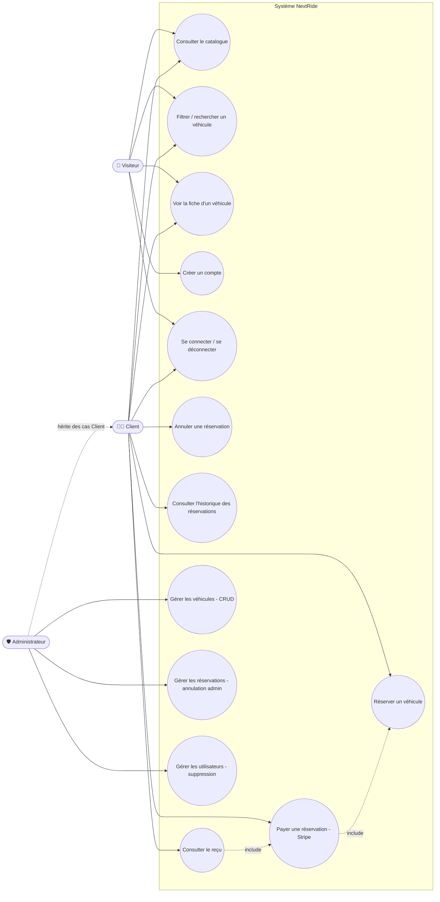
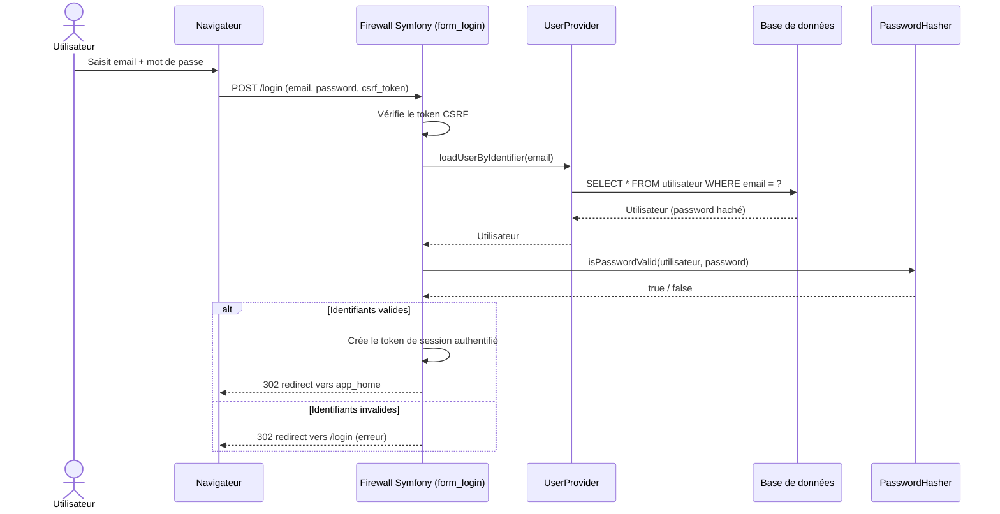
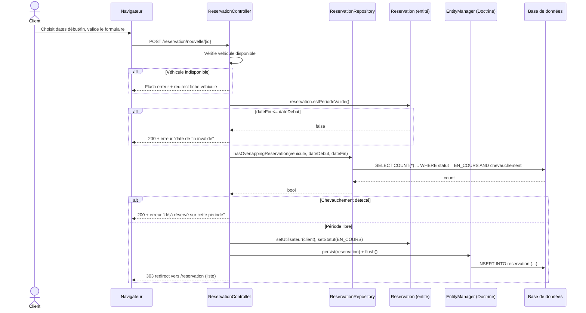
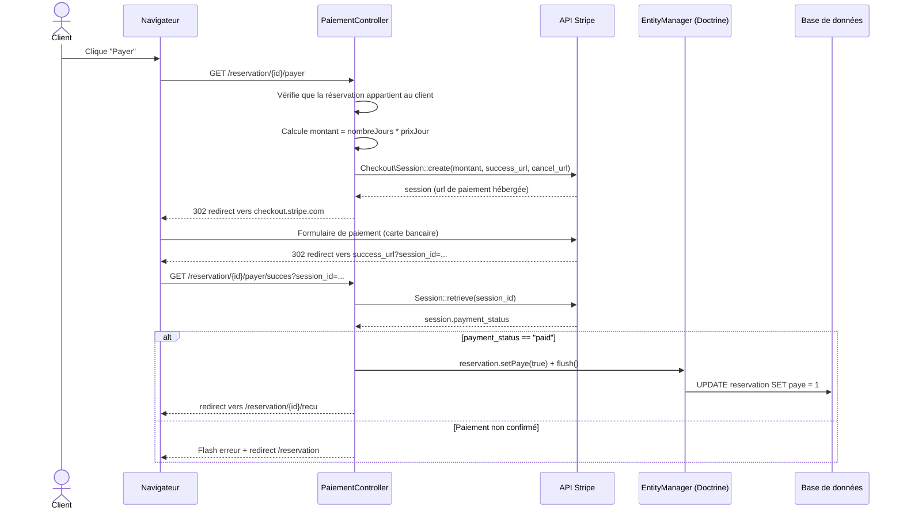
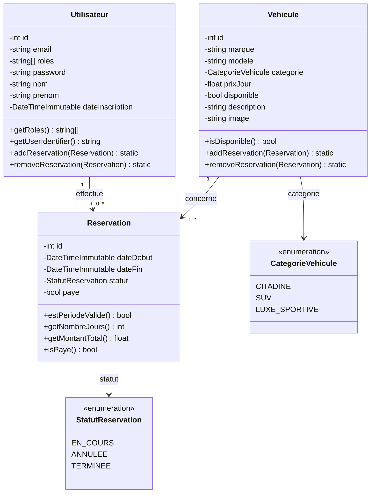
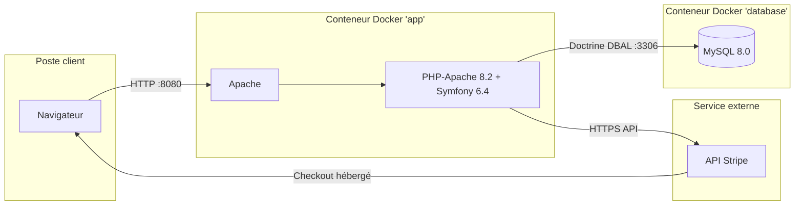

# Jalon 4 — Conception de l'application & Architecture
## NextRide — Plateforme de location de véhicules

> **Formation :** Concepteur Développeur d'Applications (CDA) — IPSSI Lille
> **Auteur :** Azeddine AMARI
> **Date :** 2026
> **Version :** 1.0
>
> Diagrammes générés à partir du code source réel (routes, contrôleurs, entités), pour une
> conformité totale entre la conception documentée et l'implémentation livrée.

---

## Sommaire

1. [Diagramme de cas d'utilisation](#1-diagramme-de-cas-dutilisation)
2. [Diagrammes de séquence](#2-diagrammes-de-séquence)
3. [Diagramme de classes](#3-diagramme-de-classes)
4. [Architecture multi-couches](#4-architecture-multi-couches)

---

## 1. Diagramme de cas d'utilisation

Trois acteurs interagissent avec le système : le **Visiteur** (non authentifié), le **Client**
(rôle `ROLE_USER`) et l'**Administrateur** (rôle `ROLE_ADMIN`). Dans l'implémentation, un compte
Administrateur possède toujours également `ROLE_USER` (voir `Utilisateur::getRoles()`), il hérite
donc de tous les cas d'utilisation du Client.

**Notes de lecture :**
- `Payer une réservation` **inclut** `Réserver un véhicule` : on ne peut payer que ce qui a
  d'abord été réservé (`PaiementController` exige une `Reservation` existante).
- `Consulter le reçu` **inclut** `Payer une réservation` : le contrôleur
  (`ReservationController::recu`) redirige si `reservation.paye === false`.
- La gestion des véhicules, réservations et utilisateurs est **exclusivement** réservée à
  `ROLE_ADMIN`, contrôlée par l'attribut `#[IsGranted('ROLE_ADMIN')]` sur les contrôleurs
  `VehiculeController` (partiellement), `AdminReservationController` et
  `AdminUtilisateurController`.

## 2. Diagrammes de séquence

### 2.1 Authentification (connexion)

### 2.2 Réservation d'un véhicule

### 2.3 Paiement d'une réservation (Stripe Checkout)

## 3. Diagramme de classes

Le diagramme se concentre sur les entités métier (voir aussi le MLD du Jalon 3) et leurs
méthodes significatives ; les classes du framework Symfony (Controller, AbstractController, etc.)
ne sont pas représentées, conformément aux recommandations du cahier des charges technique.

**Repositories associés** (couche d'accès aux données, un par entité, héritant de
`ServiceEntityRepository` de Doctrine) : `UtilisateurRepository`, `VehiculeRepository`,
`ReservationRepository`. Ce dernier porte la logique métier de détection de chevauchement de
réservations (`hasOverlappingReservation`), volontairement placée dans le repository plutôt que
dans le contrôleur pour respecter la séparation des responsabilités.

## 4. Architecture multi-couches

### Pattern MVC

NextRide est une application **full-stack Symfony** (choix justifié au Jalon 1) :

- **Contrôleurs** (`src/Controller/`) : reçoivent les requêtes HTTP, orchestrent la logique via
  les repositories et l'`EntityManager`, et retournent soit une vue Twig, soit une redirection.
  Un contrôleur par domaine fonctionnel : `HomeController`, `VehiculeController`,
  `ReservationController`, `PaiementController`, `RegistrationController`, `SecurityController`,
  `AdminReservationController`, `AdminUtilisateurController`, `LegalController`.
- **Modèle** : les entités Doctrine (`src/Entity/`) portent les données *et* une partie de la
  logique métier pure (ex : `Reservation::getMontantTotal()`, `estPeriodeValide()`), tandis que
  les repositories (`src/Repository/`) encapsulent les requêtes complexes (ex : détection de
  chevauchement de dates).
- **Vues** : templates Twig (`templates/`), organisés par domaine fonctionnel, héritant d'un
  `base.html.twig` commun.

### Architecture n-tiers (déploiement)

Chaque couche logique tourne dans un conteneur Docker distinct, orchestré par
`docker-compose.yml` (`app`, `database`, `adminer` pour l'administration BDD, `mailer` pour les
emails en développement via Mailpit). Le déploiement en production reprendrait la même
architecture n-tiers logique, les trois tiers (client, application, données) pouvant être répartis
sur des hôtes physiques différents sans changement de code.

### Séparation des responsabilités et bonnes pratiques

- **Principe de responsabilité unique** : chaque contrôleur ne gère qu'un domaine fonctionnel ;
  la logique de disponibilité des véhicules est isolée dans `ReservationRepository`, pas dupliquée
  dans les contrôleurs.
- **Sécurité par attributs** : le contrôle d'accès est déclaré directement sur les contrôleurs via
  `#[IsGranted('ROLE_ADMIN')]` / `#[IsGranted('ROLE_USER')]`, plutôt que dispersé dans la logique
  métier.
- **Configuration sensible externalisée** : la clé secrète Stripe est injectée via variable
  d'environnement (`STRIPE_SECRET_KEY`, définie dans `.env.local`, non versionnée), jamais codée
  en dur — voir `PaiementController::__construct(string $stripeSecretKey)`.
- **Validation des entrées** : les formulaires Symfony (`ReservationType`, `RegistrationForm`)
  appliquent les contraintes de validation avant toute écriture en base.

### Composants externes

| Bibliothèque | Rôle |
|---|---|
| `stripe/stripe-php` | SDK officiel Stripe, création de sessions Checkout et vérification du statut de paiement |
| `doctrine/orm` + `doctrine/doctrine-bundle` | ORM, mapping entités ↔ tables MySQL |
| `symfony/security-bundle` | Authentification, hachage des mots de passe, contrôle d'accès par rôles |
| `flatpickr` (JS, via Stimulus) | Calendrier de sélection de dates avec périodes indisponibles désactivées |
| `symfony/mailer` + Mailpit (dev) | Infrastructure d'envoi d'emails (captée localement en développement) |
